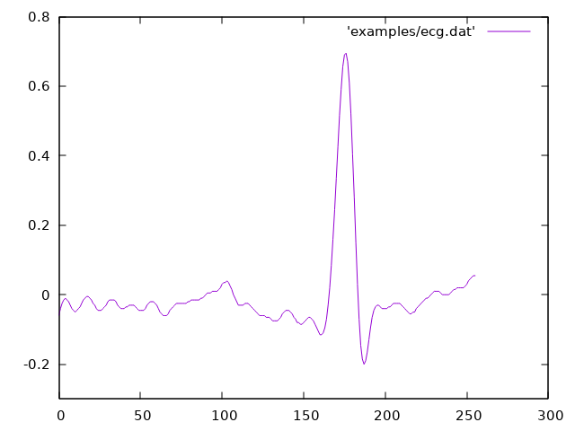
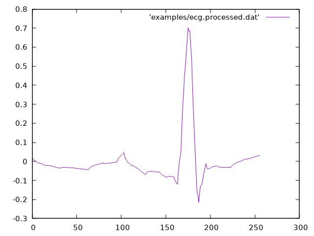

[](https://github.com/frithnanth/raku-Math-Libgsl-Wavelet/actions)

 

NAME
====

Math::Libgsl::Wavelet - An interface to libgsl, the Gnu Scientific Library - Wavelet Transform

SYNOPSIS
========

```raku
use Math::Libgsl::Wavelet;
use Math::Libgsl::Constants;

constant \N    = 256;
constant \kind =   4;

my @data;
for ^N X ^N -> ($i, $j) {
  @data[$i * N + $j] = ($i * N + $j).Num / (N * N);
}

my Math::Libgsl::Wavelet $w .= new: DAUBECHIES, kind;
my @fdata = $w.forward2d(@data);
```

DESCRIPTION
===========

Math::Libgsl::Wavelet is an interface to the Wavelet Transform functions of libgsl, the Gnu Scientific Library.

### new(UInt:D $type!, UInt:D $variant!)

### new(UInt:D :$type!, UInt:D :$variant!)

The constructor accepts two simple or named arguments: the type of wavelet function and the specific member of the wavelet family.

The available wavelet functions are:

  * **DAUBECHIES**

  * **DAUBECHIES_CENTERED**

  * **HAAR**

  * **HAAR_CENTERED**

  * **BSPLINE**

  * **BSPLINE_CENTERED**

There are two methods for dealing with 1D transforms (direct and inverse):

### forward1d(@data, UInt:D $stride where { $_ < @data.elems / 2 } = 1, UInt:D $size where { is-powerof2($_) } = @data.elems --> List)

Forward 1D transform.

The **@data** array is the only mandatory argument. The array may be larger than the set of values that one wants to transform; in that case the **$stride** and **$size** arguments define the set of values that will be transformed.

### inverse1d(@data, UInt:D $stride where { $_ < @data.elems / 2 } = 1, UInt:D $size where { is-powerof2($_) } = @data.elems --> List)

Inverse 1D transform.

The **@data** array is the only mandatory argument. The array may be larger than the set of values that one wants to transform; in that case the **$stride** and **$size** arguments define the set of values that will be transformed.

### forward2d(@data!, UInt:D $dim? where { is-powerof2($dim) } = sqrt(@data.elems).UInt, UInt:D $tda? where { $_ ≥ $dim } = $dim, :$nonstandard --> List)

### forward2d(Math::Libgsl::Matrix $data! where { $data.matrix.size1 == $data.matrix.size2 && is-powerof2($data.matrix.size1) }, :$nonstandard --> Math::Libgsl::Matrix)

Forward 2D transform.

There are two forms of this method: one accepts an array as its first argument, the other works on a Math::Libgsl::Matrix object.

The first form takes an array **@data** which represents a square matrix that must have a number of elements which is a power of 2. The @data array may contain more values than those one wants to transform; in this case the **$size** argument is the dimension of the (square) matrix to be processed and **$tda** is the physical row length.

The second form accepts a square Math::Libgsl::Matrix object whose sizes are powers of 2.

Both forms allow for a named argument **:$nonstandard**, which selects the non-standard form of the computation as detailed in the C library documentation.

### inverse2d(@data!, UInt:D $dim? where { is-powerof2($dim) } = sqrt(@data.elems).UInt, UInt:D $tda? where { $_ ≥ $dim } = $dim, :$nonstandard --> List)

### inverse2d(Math::Libgsl::Matrix $data! where { $data.matrix.size1 == $data.matrix.size2 && is-powerof2($data.matrix.size1) }, :$nonstandard --> Math::Libgsl::Matrix)

Inverse 2D transform.

There are two forms of this method: one accepts an array as its first argument, the other works on a Math::Libgsl::Matrix object.

The first form takes an array **@data** which represents a square matrix that must have a number of elements which is a power of 2. The @data array may contain more values than those one wants to transform; in this case the **$size** argument is the dimension of the (square) matrix to be processed and **$tda** is the physical row length.

The second form accepts a square Math::Libgsl::Matrix object whose sizes are powers of 2.

Both forms allow for a named argument **:$nonstandard**, which selects the non-standard form of the computation as detailed in the C library documentation.

C Library Documentation
=======================

For more details on libgsl see [https://www.gnu.org/software/gsl/](https://www.gnu.org/software/gsl/). The excellent C Library manual is available here [https://www.gnu.org/software/gsl/doc/html/index.html](https://www.gnu.org/software/gsl/doc/html/index.html), or here [https://www.gnu.org/software/gsl/doc/latex/gsl-ref.pdf](https://www.gnu.org/software/gsl/doc/latex/gsl-ref.pdf) in PDF format.

Prerequisites
=============

This module requires the libgsl library to be installed. Please follow the instructions below based on your platform:

Debian Linux and Ubuntu 20.04+
------------------------------

    sudo apt install libgsl23 libgsl-dev libgslcblas0

That command will install libgslcblas0 as well, since it's used by the GSL.

Ubuntu 18.04
------------

libgsl23 and libgslcblas0 have a missing symbol on Ubuntu 18.04. I solved the issue installing the Debian Buster version of those three libraries:

  * [http://http.us.debian.org/debian/pool/main/g/gsl/libgslcblas0_2.5+dfsg-6_amd64.deb](http://http.us.debian.org/debian/pool/main/g/gsl/libgslcblas0_2.5+dfsg-6_amd64.deb)

  * [http://http.us.debian.org/debian/pool/main/g/gsl/libgsl23_2.5+dfsg-6_amd64.deb](http://http.us.debian.org/debian/pool/main/g/gsl/libgsl23_2.5+dfsg-6_amd64.deb)

  * [http://http.us.debian.org/debian/pool/main/g/gsl/libgsl-dev_2.5+dfsg-6_amd64.deb](http://http.us.debian.org/debian/pool/main/g/gsl/libgsl-dev_2.5+dfsg-6_amd64.deb)

Installation
============

To install it using zef (a module management tool):

    $ zef install Math::Libgsl::Wavelet

AUTHOR
======

Fernando Santagata <nando.santagata@gmail.com>

COPYRIGHT AND LICENSE
=====================

Copyright 2022 Fernando Santagata

This library is free software; you can redistribute it and/or modify it under the Artistic License 2.0.

